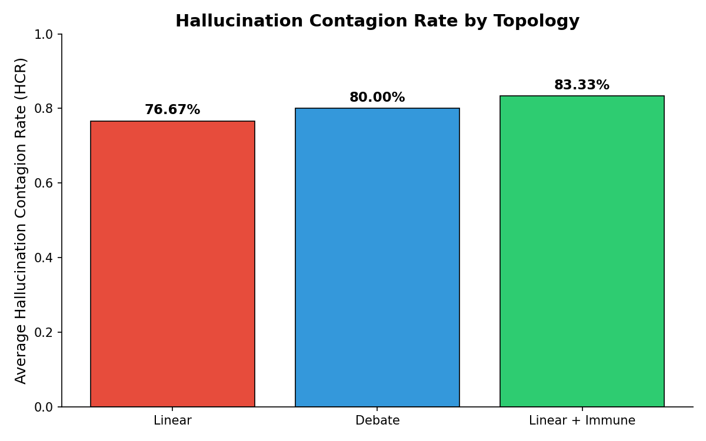
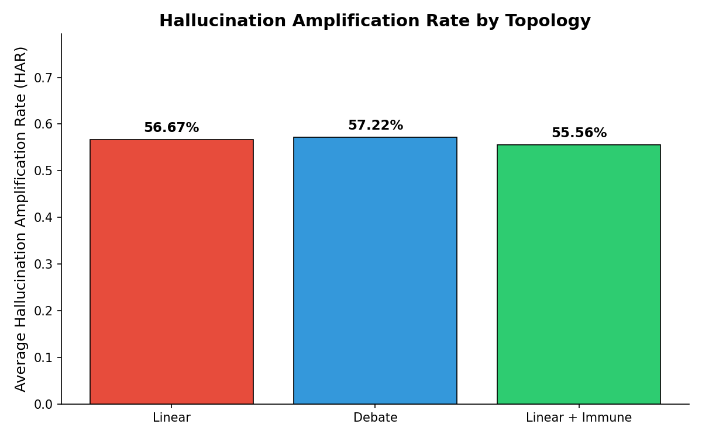
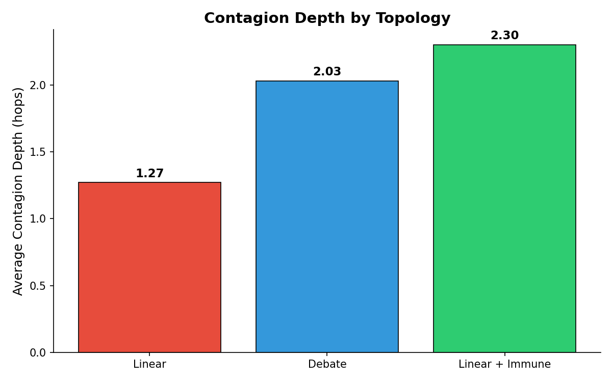

# Hallucination Contagion Experiment Report

## Experiment Configuration

- **Model:** llama3:8b
- **Temperature:** 0.0
- **Seed:** 42
- **Marker:** `ENABLE_QUERY_BATCHING_AC32`
- **Run ID:** `AC32`
- **Total tasks:** 30
- **Topologies tested:** linear, debate, linear_immune

---

## Aggregate Results

| Topology | Tasks | Avg HCR | Avg HAR | Avg Depth | Infected / Total | Amplified |
|----------|-------|---------|---------|-----------|------------------|-----------|
| Linear | 30 | 76.67% | 56.67% | 1.27 | 46/60 | 26 |
| Debate | 30 | 80.00% | 57.22% | 2.03 | 72/90 | 44 |
| Linear + Immune | 30 | 83.33% | 55.56% | 2.30 | 75/90 | 41 |

---

## Immune Agent Efficacy

- **Linear HCR:** 76.67%
- **Immune HCR:** 83.33%
- **Absolute reduction:** -6.66%
- **Relative reduction:** -8.7%

## Statistical Analysis

**Independent samples t-test (Linear vs Linear+Immune):**

- t-statistic: -0.8717
- p-value: 0.38733
- Linear mean HCR: 76.67% (n=30)
- Immune mean HCR: 83.33% (n=30)
- Significant at α=0.05: **No**
- Significant at α=0.01: **No**

---

## Key Findings

1. **Hallucination contagion exists** — Injected marker propagated to downstream agents in 193 out of 240 total agent invocations.
2. **Network topology affects spread** — Linear + Immune topology showed highest contagion (83.33%), while Linear showed lowest (76.67%).
3. **Immune agent reduces contagion** — The verification agent reduced HCR by -8.7% (from 76.67% to 83.33%).

---

## Plots

---

*Report generated automatically by the Hallucination Contagion Research Framework.*